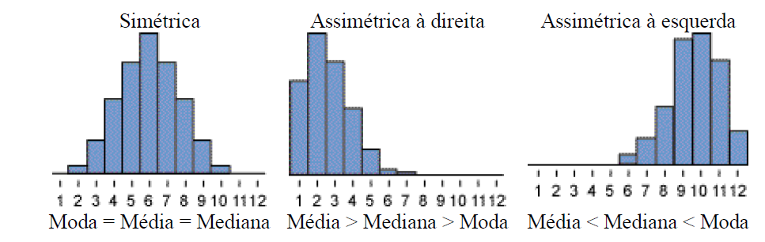

# Módulo 1 - Medidas descritivas
## Medidas Descritivas
### Média aritmética simples
Soma os itens e divide pela quantidade de itens (todo mundo sabe fazer isso)

### Mediana
Divide a amostra na metade

 - Se n for par, vai precisar tirar a média dos elementos no meio

### Moda
É o valor que mais aparece na amostra

### Dados assimétricos


### Medida de tendência central
Não há uma regra absoluta, mas:
 - Média é adequada quando não há valores erráticos ou aberrantes
 - Mediana é capaz de demonstrar quanto uma distribuição é assimétrica

### Medida de variabilidade
Às vezes é necessário estabelecer mais de uma medida para determinar qual é a variabilidade de uma amostra. 


### Amplitude
É a diferença entre o menor valor e o maior valor. Denotado por _A_

### Variância e desvio padrão
_Sigma_ é usado para representar a o desvio padrão da população. Já, para a amostra, usa-se o "_s_".

Variância é igual ao desvio padrão ao quadrado. 

#### Fórmula:


#### Exemplo de uso:


### Coeficiente de variação
É útil porque não tem unidade de medida. Ou seja, é uma medida relativa. É bom para analisar a variabilidade dos dados. 

_Observe o exemplo:_
Conjunto de valores | Média | Desvio padrão | Coeficiente de variação |
------------------- | ----- | ------------- | ----------------------- |
{1 2 3} | 2 | 1 | 0,5
{101 102 103} | 102 | 1 | 0,01
{100 200 300} | 200 | 100 | 0,5

- Os conjuntos 1 e 2 têm o mesmo desvio padrão, pois os intervalos entre os valores são iguais.

- Os níveis de variabilidade nos conjuntos 1 e 3 são proporcionalmente iguais, logo, eles têm o mesmo coeficiente de variação.

#### Fórmula:


Sua expressão se dá em porcentagem e podemos classificá-lo como a seguir:

- abaixo de 10%: homogeneidade muito alta
- de 10% a 20% homogeneidade alta
- de 20% a 30% homogeneidade média
- acima de 30% homogeneidade baixa

### Outliers
Valores muito grande ou muito pequenos comparados aos demais e, via de regra, representam poucas ocorrências, mas podem enviesar o resultado da apuração. É importante tratar esses dados. 


### Medidas de posição relativa

#### Quartis, decis e percentis. 
Basicamente são representações em %. O mais fragmentado dele é o percentil, que divide a amostra em 99 percentis, criando 100 grupos pequenos. 

Decis representa 10 percentis (dividindo a amostra em 10 grupos) e quartis representam 25 percentis (divide a amostra em 4 grupos)

#### Fórmula do percentil


Se o resultado for inteiro, precisa tirar a média do valor na posição encontrada e a próxima posição


Posição 9 = 77 e 10 = 79

Se der um número quebrado, arredonda para cima


### Converter o valor para Escore z 
e determinar qual a distância que o valor procurado está da média (em desvio padrão)

(O objetivo de se calcular o escore z é expressar em unidades de desvio padrão quanto um determinado número está distante da média.)


X ( valor que você quer converter)
X linha: média
S: desvio padrão 

### Tabelas
#### Regra de Sturges
Serve para dividir os dados em classes. Ele determina em quantas partes temos que dividir os dados 

#### Fórmula:
```
K = 1 + 3,322.log n
```

Para determinar o tamanho de cada classe divide a amplitude (dada por ``` máximo - mínimo ```) por K:

```
Ak = A/K
```
