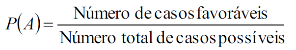
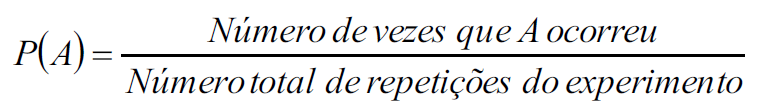
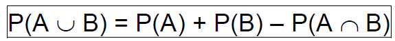
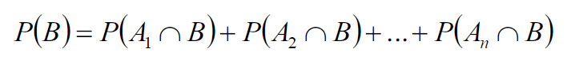
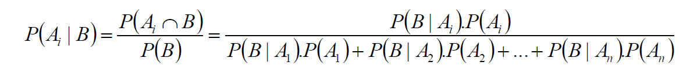

# Módulo 2 - Probabilidade
A probabilidade é uma medida numérica da possibilidade de um evento ocorrer (0 - 1).

## Experimento aleatório
São experimentos em que seus resultados não são os mesmos, apesar de serem executados de formas idênticas. 

## Espaço amostral
Conjunto de todos os resultados possíveis

## Evento
É um subconjunto de elementos de um espaço amostral.

## Axiomas de probabilidade
Denota-se a Probabilidade de um evento A por P(A)

## Atribuição probabilidades aos elementos do espaço amostral
Se dá pela formula

ou

Para encontrar a união de eventos utiliza-se a seguinte fórmula:

## Probabilidade condicional
A probabilidade de um evento ocorrer sabendo-se da ocorrência de um evento anterior. 
Utiliza a regra do produto para calcular. 

## Independência de eventos
É quando os eventos não dependem da ocorrência um do outro. Utiliza a fórmula para calcular a união de eventos. 

## Teorema da probabilidade total
Utiliza a fórmula:

## Teorema de Bayes
Fórmula:

