# Módulo 3 - Inferência estatística

## Estimação de parâmetros estatísticos

Entre os estimadores mais comuns estão:

- Média amostral (x com traço em cima)
- Desvio padrão amostral (s) 
- Proporção amostral (p chapéu)

## Estimativa pontual
São as estimativas que geram um único valor, como a média, desvio padrão e proporção

## Estimativa intervalar e grau de confiança
Estimativa intervalar é uma medida da certeza de que o intervalo contém o parâmetro populacional
Grau de confiança é a probabilidade 1 - a de o intervalo de confiança conter o verdadeiro valor do parâmetro populacional (também chamado de nível de confiança)

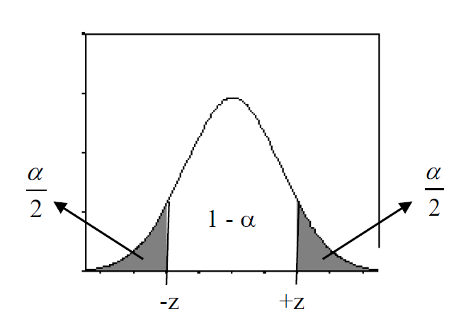

### Valor crítico
É dado pelo termo: 
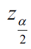

### Margem de erro
Calculo da margem de erro se dá pela equação:
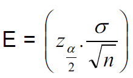

Exemplo: se eu quiser saber quanto poderá variar para cima ou para baixo a partir de um parâmetro, como a média, uso a fórmula acima e acrescento E subtraio da média o resultado dessa operação. 

Exemplo aplicado:
```
	Em uma indústria de cerveja, a quantidade de cerveja inserida em latas tem-se comportado como uma variável aleatória distribuída normalmente com média 350 ml e desvio padrão 3 ml. Após alguns problemas na linha de produção, suspeita-se que houve alteração na média. Uma amostra de 120 latas acusou média 346 ml. Encontre a estimativa pontual e construa um intervalo de confiança para o novo valor da quantidade média de cerveja inserida em latas, com nível de confiança de 95%, supondo que não tenha ocorrido alteração no desvio padrão do processo.
```

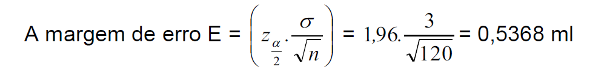

```
	O intervalo de confiança será I.C. =[ x − E ; x + E ] = [346-0,5368 ; 346+0,5368] = [345,46 ml ; 346,54 ml].
```

### Determinar o tamanho da amostra
Para determinar o tamanho da amostra, dado o valor do desvio padrão, isola-se a variável n na fórmula anterior, conforme segue: 

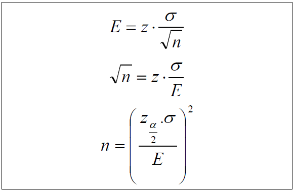

## População finita
Se a população for finita usar a fórmula abaixo:
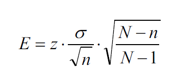

Para isolar n, usar:

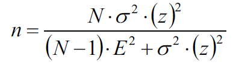

Arredondar o resultado para cima, para os casos onde ele não for inteiro. 

Desvio padrão desconhecido
Se o desvio padrão não for conhecido, há dois caminhos a se seguir: 
	
- Utilizar a regra prática para estimar o desvio padrão da seguinte maneira:

- 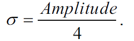

	
- Realizar um estudo piloto. Com base na coleção de pelo menos 31 valores amostrais selecionados aleatoriamente, calcular o desvio padrão amostral (s) e utiliza-lo no lugar de sigma

## Intervalo de confiança para a média quando sigma é desconhecido
Usa-se t-student para determinar a média quando se desconhece o sigma (desvio padrão) da população

O princípio é o mesmo do que quando você sabe o sigma. Precisa dividir o grau de confiança por dois. Isso é, se você busca um grau de confiança de 95%, então você divide 5 por dois (100-95), que vai dar 2,5. Então teremos o valor de 0,025, na tabela t-student esse valor corresponde a 2.201

## Intervalo de confiança para a proporção 
As condições precisam ser atendidas: 

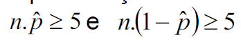

É dada pela fórmula:


Exemplo aplicado:
```
Em uma linha de produção de certa peça cerâmica, colheu-se uma amostra de 125 itens, constatando-se 7 peças eram defeituosas. Com esses resultados amostrais, determine a estimativa intervalar de 87% de confiança da proporção de peças defeituosas produzidas pela empresa.

Atende os requisitos: 
```
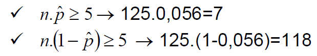

Determina o valor de Z:

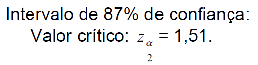

Aplica a fórmula:

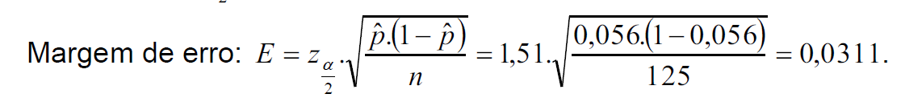

Intervalo de confiança: pˆ + E = 0,056 +/- 0,0311= [0,0249 ; 0,0871]

## Determinar o tamanho da amostra para a proporção
Isola "n" na fórmula anterior:

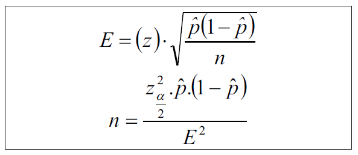


Se não tivermos "p" então provemos o valor 0.5 para p. A razão dada é que:
"O valor máximo possível do produto p^*(1 -p^) é 0,25, que ocorre quando p^ =0,5"

Para "n" o valor precisa ser inteiro, então no caso de decimal, arredonda-se para cima. 