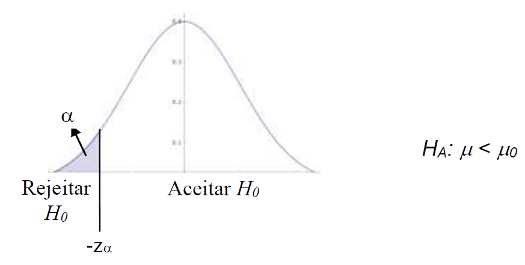

# Módulo 4 - Teste de hipótese

# Testes de hipóteses
Usa estatística amostral para testar uma alegação sobre o valor de um parâmetro populacional. 

## Hipóteses estatísticas
Temos a hipótese nula e a hipótese alternativa. A hipótese nula é o que queremos testar, a alternativa é o complemento. 

Hipótese nula é representada por H0 e está ligada a média ou a proporção e são usados os sinais de >=, <= ou = (bilateral).

Hipótese alternativa é o complemento da hipótese nula, então quando H0 = X, Ha deve ser Ha != X. 

## Tipos de erros e nível de significância 

Há dois tipos que podem ocorrer quando baseamos nossa decisão em uma amostra. 

Rejeitar uma hipótese quando ela na verdade era verdadeira (alfa), ou aceitar uma hipótese quando na verdade ela era falsa (beta). Isso pode acontecer quando o tamanho da amostra é insuficiente, por exemplo. 

Para reduzir qualquer um dos dois tipos precisa aumentar o tamanho da amostra, mas se mantivermos o tamanho da amostra fixo e tentarmos diminuir o erro alfa, aumentará o erro beta e vice versa. 

## Estatística de teste, região crítica e valor crítico

Estatística de teste é o conjunto de informações que levam a uma tomada de decisão. Região crítica é o conjunto dos valores da estatística de testes e o valor crítico é o valor que separa as decisões. 

A região crítica pode ser bilateral ou lateral à direita ou à esquerda. Depende no que estamos focado (se X é maior que determinado valor, por exemplo, então estamos preocupado com os valores unilaterais à direita). 

## Etapas do teste de hipótese

1. Identificar a hipótese nula (contém a condição de igualdade) e a hipótese alternativa (complementar)
2. Escolher o nível de significância com base na gravidade do erro tipo I. São muito comuns os valores 0,05 e 0,01.
3. Identificar o teste a ser utilizado.
4. Determinar a estatística de teste.
5. Determinar o(s) valor(es) crítico(s) e a região crítica.
6. Rejeitar H0 se a estatística de teste está na região crítica. Aceitar H 0 se a estatística de teste não está na região crítica.
7. Formular uma conclusão que descreva a conseqüência prática dos dados e dos cálculos.

## Teste de hipótese quando sigma(desvio padrão da populacão) é conhecido 

Fórmula: 

Considerar os gráficos:

Considerar os critérios:

 

O método do valor p para o teste de hipóteses
Dada uma hipótese nula e um conjunto de dados amostrais, o valor p reflete a probabilidade de se obter tais resultados no caso da hipótese nula ser, de fato verdadeira, ou seja, **quantifica o erro cometido ao rejeitar a hipótese nula**.

O critério de decisão baseado no valor p é feito da seguinte maneira:

- Rejeitar a hipótese nula (H0) se o valor p é no máximo igual ao nível de significância (alfa).
- Não rejeitar a hipótese nula (H0) se o valor p é maior do que o nível de significância (alfa).

## Teste de hipóteses parra uma média quando sigma é desconhecido (Teste t-Student parra uma amostra)
Considere a fórmula:

Segue o mesmo princípio que anteriormente, só que é aplicado quando não se tem o desvio padrão populacional. Usa-se a tabela T-Student, em detrimento da tabela de Z. 

## Teste de hipótese para uma proporção

Os testes de hipóteses para proporções são adequados quando os dados sob análise consistem de contagens ou frequências de itens. A finalidade de tais testes é avaliar afirmações sobre a proporção (ou percentagem) de uma população.

É importante atender o seguinte critério:

Considere a fórmula:

Sendo que:

Em muitos aspectos, o teste de hipóteses para uma proporção se assemelha grandemente ao teste z, principalmente pelo fato de que utilizam a mesma distribuição de probabilidades. Dessa forma, a região crítica, o valor crítico e o valor p para o teste de proporção são obtidos exatamente da mesma maneira que o teste z para uma média.
